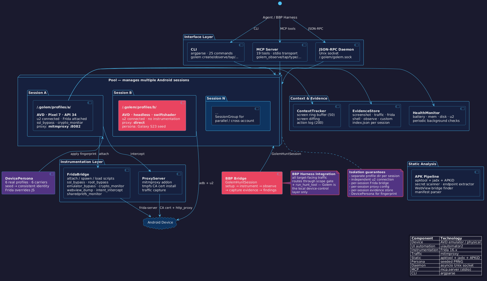

instrumented android session orchestrator.

AVD/physical device management, UI automation via uiautomator2, Frida instrumentation,
mitmproxy traffic interception, static analysis, evidence collection.
daemon mode with JSON-RPC API and MCP server for agent-driven automation.

### Architecture



### Install

```bash
git clone https://github.com/AbuCTF/Golem.git
cd Golem
pip install -e .
```

prerequisites:
- Android SDK (emulator, avdmanager, sdkmanager, adb)
- Python 3.11+
- Frida (`pip install frida-tools`)
- mitmproxy (`pip install mitmproxy`)
- apktool, jadx, APKiD (for static analysis)

### Quick start

#### CLI

```bash
golem create test-phone --headed
golem create headless-a
golem list
golem status test-phone
golem observe test-phone
golem tap test-phone "Settings"
golem type test-phone "search query"
golem fill test-phone "Search" "hello world"
golem press test-phone back
golem swipe test-phone up
golem screenshot test-phone evidence.png
golem screen test-phone
golem diff test-phone
golem health test-phone
golem shell test-phone "pm list packages -3"
golem install test-phone target.apk
golem launch test-phone com.target.app
golem cert-install test-phone
golem proxy-on test-phone --port 8082
golem proxy-off test-phone
golem frida-scripts
golem persona "hunt-seed-001"
golem evidence test-phone list
golem evidence test-phone capture --desc "login screen"
golem analyze target.apk
golem close test-phone
golem destroy test-phone

# start the daemon
golem daemon

# start the MCP server (stdio)
golem mcp
```

#### Direct Client

```python
from golem import Pool

async with Pool() as pool:
    s = await pool.create("test-phone", headless=True)

    # observe interactive elements (indexed for tap targets)
    elements = await s.observe()
    for el in elements:
        print(f"[{el.idx}] {el.cls} — {el.text}")

    # tap by index, text, or resource ID
    await s.tap(0)
    await s.tap("Settings")
    await s.tap("id:com.android.settings:id/search_bar")

    # type and fill
    await s.fill("Search", "wifi")
    await s.type_text("hello", clear=True)

    # screen state after every action
    state = await s.screen_state()

    # screen diffing — what changed since last observe
    diff = await s.observe_diff()
    print(diff.summary())

    # screenshots
    png = await s.screenshot("evidence.png")

    # shell commands
    output = await s.shell("dumpsys activity top")

    # app lifecycle
    await s.app_install("target.apk")
    await s.app_start("com.target.app")
    apps = await s.app_list()

    # frida instrumentation
    await s.frida_attach("com.target.app")
    await s.frida_load("ssl_bypass", "crypto_monitor")
    messages = await s.frida_messages("crypto_monitor")
    await s.frida_detach()

    # proxy + cert
    await s.proxy_install_cert()
    await s.proxy_configure(port=8082)

    # evidence collection
    eid = await s.capture_screenshot_evidence("login bypass")
    items = s.evidence.list()

    # health monitoring
    status = await s.health_check()

    await s.close()

    # reopen later — device still running
    s = await pool.get("test-phone", launch=True)
```

#### Multi-session / cross-account

```python
from golem import Pool, SessionGroup

async with Pool() as pool:
    group = SessionGroup(pool, "idor-test")
    await group.add("account-a")
    await group.add("account-b")

    await group.install_all("target.apk")
    await group.launch_all("com.target.app")

    # observe all sessions in parallel
    results = await group.observe_all()

    # run arbitrary action across all sessions
    results = await group.run_all(lambda s: s.tap("Profile"))
```

#### BBP Harness Integration

```python
from golem.bbp_bridge import GolemHuntSession

async with GolemHuntSession("hunt-opensea-001", persona_seed="opensea-a") as hunt:
    await hunt.setup("com.opensea.app", apk_path="opensea.apk")
    await hunt.instrument(["ssl_bypass", "crypto_monitor", "intent_intercept"])

    elements = await hunt.observe()
    await hunt.tap("Sign in")
    eid = await hunt.capture("login screen reached")

    messages = await hunt.frida_messages("crypto_monitor")
    hunt.add_finding(
        title="hardcoded API key in crypto init",
        category="info-disclosure",
        severity="medium",
        description="AES key derived from static seed",
        evidence_ids=[eid],
    )

    print(hunt.findings_summary())
```

### Features

| Feature | Description |
|---------|-------------|
| **Device management** | AVD create/boot/shutdown + physical device support |
| **Session isolation** | Separate profile dir, u2 connection, Frida bridge, proxy per session |
| **UI automation** | observe, tap, type, fill, press, swipe, scroll_to, wait_element |
| **Screen diffing** | What changed between observations (activity, elements, count) |
| **Context tracking** | Ring buffer of screen states (50) and actions (200) |
| **Frida instrumentation** | 7 scripts: SSL bypass, root/emulator bypass, crypto monitor, WebView dump, intent intercept, SharedPrefs monitor |
| **Traffic interception** | mitmproxy with tmpfs CA cert install for Android 11+ |
| **Static analysis** | apktool + jadx + APKiD, secret scanner, endpoint extractor, WebView bridge finder, manifest parser |
| **Device personas** | 6 real device profiles, 6 carriers, seeded PRNG for consistent fingerprints |
| **Evidence store** | Screenshot, traffic, Frida, shell, observe capture with index |
| **Health monitoring** | Battery, memory, disk, u2 responsiveness, periodic checks |
| **Multi-session** | Parallel observe/screenshot/action, SessionGroup, cross-account testing |
| **MCP server** | 19 tools for agent integration via stdio |
| **JSON-RPC daemon** | Unix socket server for persistent session management |
| **BBP bridge** | GolemHuntSession for bug-bounty harness integration |

### Frida scripts

| Script | What it hooks |
|--------|---------------|
| `ssl_bypass` | TrustManager, OkHttp CertificatePinner, Conscrypt, WebViewClient SSL errors, NetworkSecurityConfig |
| `root_bypass` | su paths, Runtime.exec, PackageManager (root packages), Build.TAGS, RootBeer |
| `emulator_bypass` | Build.*, TelephonyManager, SystemProperties, sensors, emulator files |
| `crypto_monitor` | Cipher.doFinal, SecretKeySpec, MessageDigest, Mac, IvParameterSpec |
| `webview_dump` | addJavascriptInterface, loadUrl, evaluateJavascript, shouldOverrideUrlLoading |
| `intent_intercept` | startActivity, sendBroadcast, startService, ContentResolver.query, deep links |
| `sharedprefs_monitor` | getString/putString reads and writes with interesting-key filtering |

### Device personas

| Profile | Model |
|---------|-------|
| Pixel 7 | Google Tensor |
| Pixel 6 Pro | Google Tensor |
| Galaxy S23 Ultra | Samsung Exynos |
| Galaxy A54 | Samsung Exynos |
| Redmi Note 12 | Xiaomi Snapdragon |
| OPPO A58 | OPPO MediaTek |

each persona bundles matching IMEI, Android ID, build props, SIM info, carrier. same seed = same identity.

### License

`MIT`
